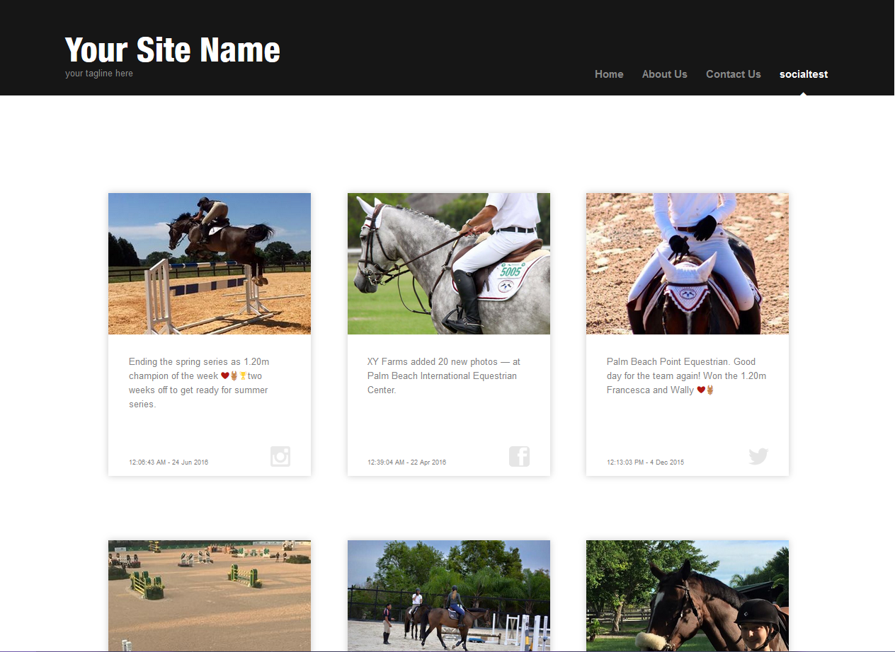
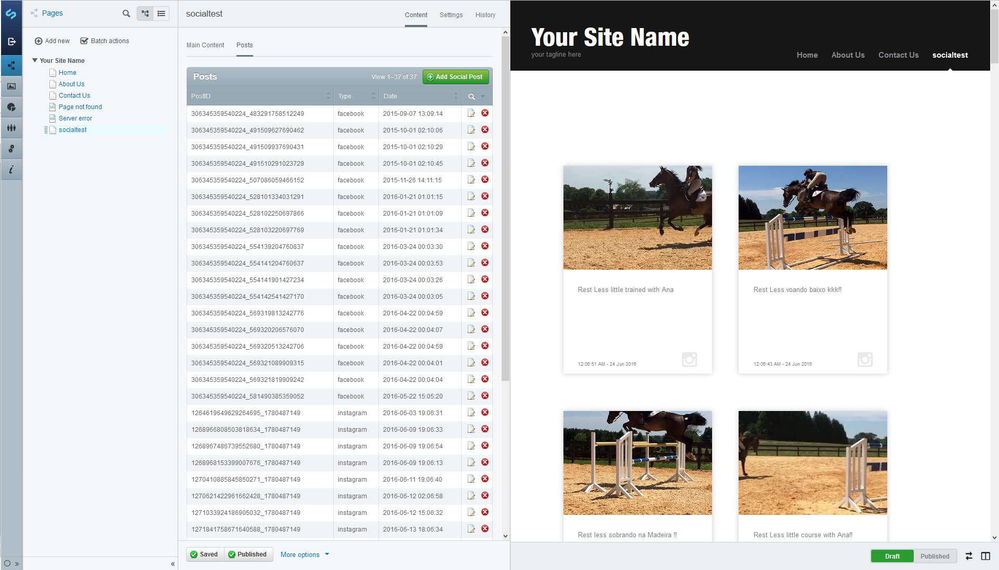
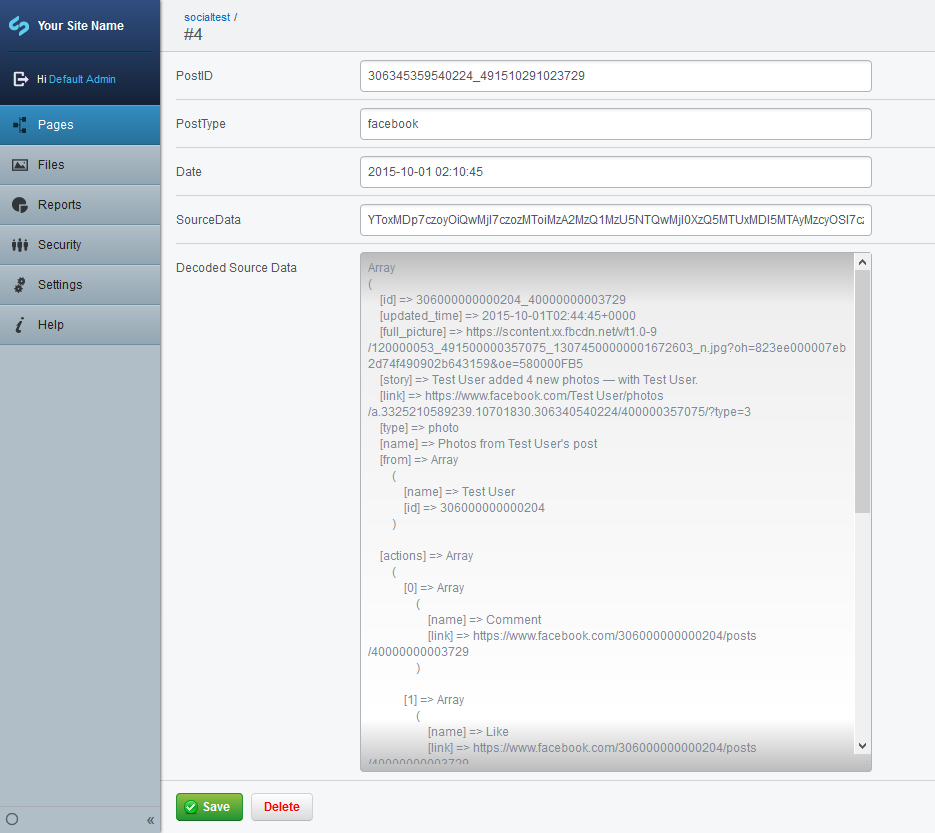
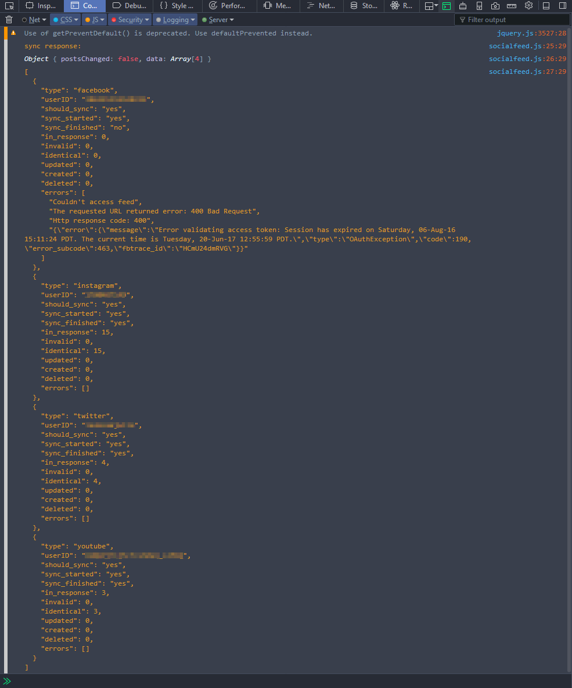

# Socialfeed for SilverStripe


## Introduction
This module allows you to display an aggregated feed of posts originated from various social media sites.  


## Goals
*   allows you to seamlessly integrate posts from multiple social media sites into a news or blog page.
*   helps to stay within API access limits.
*   speeds up page load by caching the posts in the local database.


## Features
*   Facebook, Instagram, Twitter and YouTube type feeds are implemented.
*   multiple feeds of the same type can be used.


My intention was to make it easier to adapt the module to other frameworks. The core functionality is not relying on Silverstripe.


## Screenshots

### SocialFeed Page
<!--  -->


### Synced posts in the cms
<!--  -->


<!--  -->


### Response of the sync action called by js on page load
(You have to be logged in as administrator.)

<!--  -->


## installation

```
composer require "devcreative/socialfeed"
```


## Usage

*   edit the config file: Socialfeed.yaml  
 (Multiple feeds of the same type can be added.)

*   create a new SocialFeedPage.


### Example of combining posts with news

```php

//news source
class News extends DataObject {

    private static $db = array(
        ,"Date" => "Date"
        ,"Title" => "Varchar(255)"
        ,"Content" => "HTMLText"
    );

    public function date() {
        return $this->Date;
    }

	//...
}

class SocialFeedPage_Controller extends Page_Controller {

	//...

	public function getPosts() {

		 //get news and posts
         $allNews = News::get();
         $allPosts = $this->feeds->getAllPosts();

		 //merge into one array
         foreach ($allNews as $news) {
             array_push($allPosts, $news);
         }  

		 //sort by date
         usort($allPosts, function($a, $b) {
             return ($a->date() < $b->date())?true:false;
         });           

         //create ArrayList for template
         $list = ArrayList::create(array());

		 //add the sorted news and posts
         foreach ($allPosts as $post) {
              $list->push(
                 (get_class($post) == "News")?$post:ArrayData::create($post->data())
              );
         }

         return new ArrayData(array("Posts" => $list));
     }

	 //...
 }

 //templates may need to be modified to display news

```

### Todo

*   Every API has different access limits. Currently there is only one default available: 10 minutes has to pass between two syncs. canSync() functions should be implemented for every feed class.
*   Create an admin area in the cms for the feed settings, instead of using the yaml file
*   The queried and processed fields are hardcoded into the feed classes. They should be editable in the cms, or in the config file.
